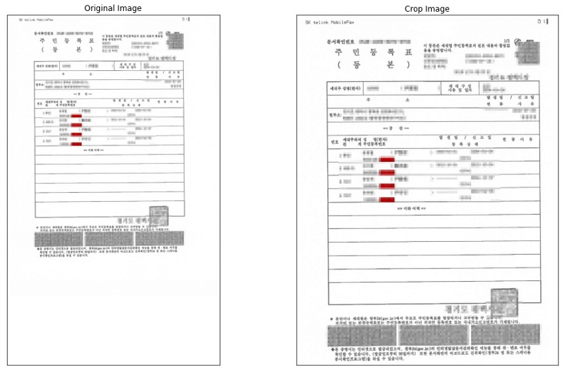

# Document image crop
이미지에서 텍스트가 포함된 영역만 찾아 자르기 위함



# usage

### get_box_crop_img:
1) 이미지에서 가장 큰 사각형을 검출
2) 영역 자르기

```python
import cv2
from crop import get_box_crop_img

img_path = 'test_image/test_image1.jpg'
img = cv2.imread(img_path)

crop_img = get_box_crop_img(img)
```